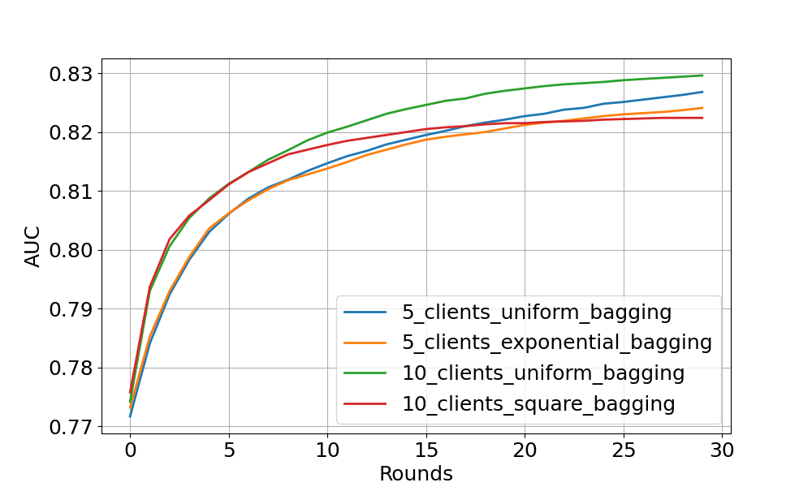
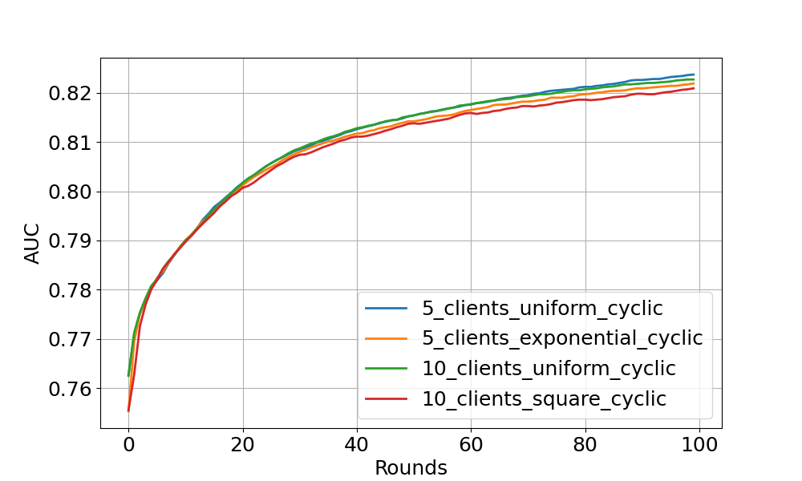

# CLEF xgboost example
In this example we apply federated xgboost to the CLEF dataset, specifically task c at M0, which means only data that was available at intake is used for training the model. The code is adapted from the Flower example [xgboost-comprehensive](https://github.com/adap/flower/tree/main/examples/xgboost-comprehensive).

Before we can run the experiment, we first need to download CLEf. See the main repo of this branch for instructions. After that, we will need to create paritions of the data. This is done by running the `partition_clef.py` script.
```
python partition_clef.py --data_path <path_to_clef_data> --partitions <num_partitions>
e.g.
python partition_clef.py --data_path /Users/hereditary_data/clef_data/retrospective/ALS/CSV/data/datasetC/ --partitions 2,4,6,10
```

To run the experiment as a simulation, first follow the one-time setup instructions.
```
# Create a new virtual environment if desired:
# python -m venv fed-ai-venv
# source fed-ai-venv/bin/activate

# Install the dependencies
pip install -e .
```

# Running the code
Before you can run the code, we need to export an environment variable to indicate where the data is located.
```
export CLEF_DATA_PATH=<path_to_clef_data>
```

## Running the code in simulation mode
You can run the experiment using the following command:
```
flwr run .
```

# Running the code in a federated setting
This section will explain how to run the code in a federated setting, on a single machine. If you wish to run the code on multiple machines, you can do so, but you will need to make sure that the devices are able to communicate with each other and make sure that you pass the right IP addresses and ports to the different components.

First, go into the pyproject.toml file and change the default federation from local-simulation to local-superlink.
```
[tool.flwr.federations]
default = "local-superlink"
```

### starting all components
Now, open four terminals and run the following commands in each terminal:
```
flower-superlink --insecure
```
```
export CLEF_DATA_PATH=<path_to_clef_data>
flower-supernode --insecure --node-config "num-partitions=2 partition-id=0"
```
We will need to make sure the second supernode is using a different port for the clientappio-api-address.
```
export CLEF_DATA_PATH=<path_to_clef_data>
flower-supernode --insecure --clientappio-api-address 127.0.0.1:9095 --node-config "num-partitions=2 partition-id=1"
```
Once all the supernodes are running, you should see frequent logs in the supernode along the lines of: `INFO :      [Fleet.PullTaskIns] node_id=11258183141104355277`

Now we are ready to run the experiment.
```
flwr run . --stream --run-config "train-method='bagging' num-server-rounds=5 centralised-eval=false"
```

Instructions on how to connect the superlink and nodes without using the `--insecure` flag will be added here soon.

### Some tricks
If you wish to see all logs when running this experiment as a simulation, export the below variable. This will ensure you will see all logs, if not set, the logs coming from the same line will be deduplicated, even when they contain different information.
```
export RAY_DEDUP_LOGS=0
```


<br>
<br>
<br>
<br>

# Below you can find the original README of the flower example. 


---
tags: [advanced, classification, tabular]
dataset: [HIGGS]
framework: [xgboost]
---

## Federated Learning with XGBoost and Flower (Comprehensive Example)

This example demonstrates a comprehensive federated learning setup using Flower with XGBoost.
We use [HIGGS](https://archive.ics.uci.edu/dataset/280/higgs) dataset to perform a binary classification task. This examples uses [Flower Datasets](https://flower.ai/docs/datasets/) to retrieve, partition and preprocess the data for each Flower client.
It differs from the [xgboost-quickstart](https://github.com/adap/flower/tree/main/examples/xgboost-quickstart) example in the following ways:

- Customised FL settings.
- Customised partitioner type (uniform, linear, square, exponential).
- Centralised/distributed evaluation.
- Bagging/cyclic training methods.
- Support of scaled learning rate.

## Training Strategies

This example provides two training strategies, [**bagging aggregation**](https://flower.ai/docs/framework/tutorial-quickstart-xgboost.html#tree-based-bagging-aggregation) ([docs](https://flower.ai/docs/framework/ref-api/flwr.server.strategy.FedXgbBagging.html)) and [**cyclic training**](https://flower.ai/docs/framework/tutorial-quickstart-xgboost.html#cyclic_training) ([docs](https://flower.ai/docs/framework/ref-api/flwr.server.strategy.FedXgbCyclic.html)).

### Bagging Aggregation

Bagging (bootstrap) aggregation is an ensemble meta-algorithm in machine learning,
used for enhancing the stability and accuracy of machine learning algorithms.
Here, we leverage this algorithm for XGBoost trees.

Specifically, each client is treated as a bootstrap by random subsampling (data partitioning in FL).
At each FL round, all clients boost a number of trees (in this example, 1 tree) based on the local bootstrap samples.
Then, the clients' trees are aggregated on the server, and concatenates them to the global model from previous round.
The aggregated tree ensemble is regarded as a new global model.

This way, let's consider a scenario with M clients.
Given FL round R, the bagging models consist of (M * R) trees.

### Cyclic Training

Cyclic XGBoost training performs FL in a client-by-client fashion.
Instead of aggregating multiple clients,
there is only one single client participating in the training per round in the cyclic training scenario.
The trained local XGBoost trees will be passed to the next client as an initialised model for next round's boosting.

## Set up the project

### Clone the project

Start by cloning the example project:

```shell
git clone --depth=1 https://github.com/adap/flower.git _tmp \
        && mv _tmp/examples/xgboost-comprehensive . \
        && rm -rf _tmp \
        && cd xgboost-comprehensive
```

This will create a new directory called `xgboost-comprehensive` with the following structure:

```shell
xgboost-comprehensive
├── xgboost_comprehensive
│   ├── __init__.py
│   ├── client_app.py   # Defines your ClientApp
│   ├── server_app.py   # Defines your ServerApp
│   └── task.py         # Defines your model, training and data loading
├── pyproject.toml      # Project metadata like dependencies and configs
└── README.md
```

### Install dependencies and project

Install the dependencies defined in `pyproject.toml` as well as the `xgboost_comprehensive` package.

```bash
pip install -e .
```

## Run the project

You can run your Flower project in both _simulation_ and _deployment_ mode without making changes to the code. If you are starting with Flower, we recommend you using the _simulation_ mode as it requires fewer components to be launched manually. By default, `flwr run` will make use of the Simulation Engine.

### Run with the Simulation Engine

```bash
flwr run .
```

You can also override some of the settings for your `ClientApp` and `ServerApp` defined in `pyproject.toml`. For example:

```bash
# To run bagging aggregation for 5 rounds evaluated on centralised test set
flwr run . --run-config "train-method='bagging' num-server-rounds=5 centralised-eval=true"

# To run cyclic training with linear partitioner type evaluated on centralised test set:
flwr run . --run-config "train-method='cyclic' partitioner-type='linear' centralised-eval-client=true"
```

> \[!TIP\]
> For a more detailed walk-through check our [XGBoost tutorial](https://flower.ai/docs/framework/tutorial-quickstart-xgboost.html).
> To extend the aggregation strategy for saving, logging, or other functions, please refer to our [advanced-pytorch](https://github.com/adap/flower/tree/main/examples/advanced-pytorch) example.

### Run with the Deployment Engine

> \[!NOTE\]
> An update to this example will show how to run this Flower application with the Deployment Engine and TLS certificates, or with Docker.

## Expected Experimental Results

### Bagging aggregation experiment

<div style="text-align: center;">

</div>

The figure above shows the centralised tested AUC performance over FL rounds with bagging aggregation strategy on 4 experimental settings.
One can see that all settings obtain stable performance boost over FL rounds (especially noticeable at the start of training).
As expected, uniform client distribution shows higher AUC values than square/exponential setup.

### Cyclic training experiment

<div style="text-align: center;">

</div>

This figure shows the cyclic training results on centralised test set.
The models with cyclic training requires more rounds to converge
because only a single client participate in the training per round.

Feel free to explore more interesting experiments by yourself !
